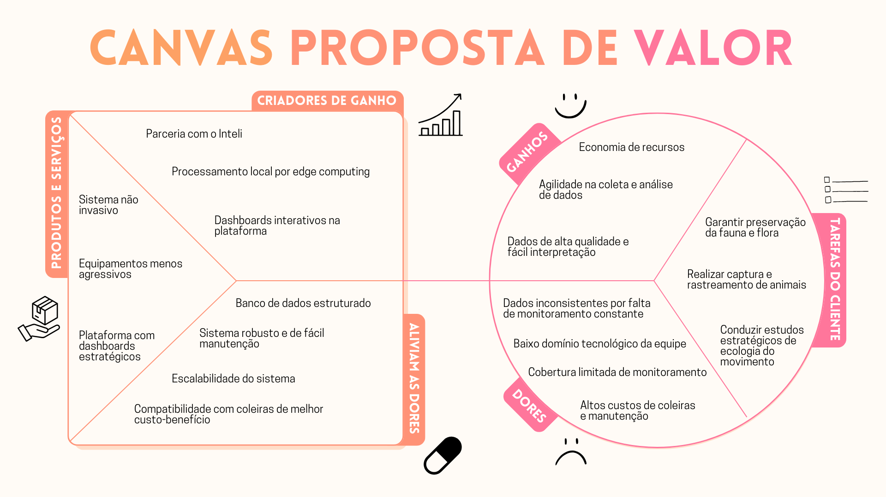

# Canvas Proposta de Valor 

## Solução
### Criadores de Ganho
- **Parceria com o Inteli:** A colaboração com o Inteli viabilizou financiamento e apoio técnico, permitindo à Sauá desenvolver a solução sem altos custos e com acesso a know-how especializado.
- **Processamento local por edge computing:** O processamento direto nas coleiras otimiza a coleta e análise dos dados, reduzindo tempo de resposta e minimizando dependência de conexão constante.
- **Dashboards interativos na plataforma:** Visualizações claras e dinâmicas facilitam a interpretação e tomada de decisão rápida por pesquisadores e órgãos ambientais.

### Produtos e Serviços
- **Sistema não invasivo**: Desenvolvido para minimizar impactos sobre fauna e flora, garantindo que o monitoramento ocorra sem comprometer o comportamento natural dos animais.
- **Equipamentos menos agressivos:** A tecnologia permite o uso de coleiras mais leves e menos invasivas, preservando o bem-estar animal durante o monitoramento.
- **Plataforma com dashboards estratégicos:** Permite analisar padrões de movimento e comportamento da fauna de forma integrada e comparativa, apoiando decisões de manejo e conservação.

### Aliviam Dores
- **Banco de dados estruturado:** Organização e centralização das informações de telemetria, reduzindo erros e facilitando análises de longo prazo.
- **Sistema robusto e de fácil manutenção:** Estrutura projetada para suportar operações em campo, mas com simplicidade de atualização e reparo.
- **Escalabilidade do sistema:** Arquitetura adaptável que permite expandir o monitoramento para novos biomas, espécies e regiões.
- **Compatibilidade com coleiras de melhor custo-benefício:** Solução pensada para funcionar com dispositivos mais acessíveis, reduzindo despesas operacionais e de reposição.

## Cliente
### Ganhos
- **Economia de recursos:** Redução de custos com importação, manutenção e comunicação via satélite, viabilizando estudos mais amplos.
- **Agilidade na coleta e análise de dados:** Processamento local diminui o tempo entre a coleta e a disponibilização da informação, acelerando respostas.
- **Dados de alta qualidade e fácil interpretação:** Visualizações intuitivas e métricas consistentes aumentam a precisão e a utilidade das informações coletadas.

### Tarefas do Cliente
- **Garantir preservação da fauna e flora:** Monitorar espécies sem comprometer o ecossistema, reduzindo impactos de captura e rastreamento.
- **Realizar captura e rastreamento de animais:** Utilizar dispositivos de GPS-telemetria para compreender deslocamentos e padrões comportamentais.
- **Conduzir estudos estratégicos de ecologia do movimento:** Analisar deslocamentos e interações com o habitat para embasar planos de manejo e conservação.

### Dores
- **Dados inconsistentes por falta de monitoramento constante:** Equipamentos atuais dependem de conectividade e apresentam falhas de registro.
- **Baixo domínio tecnológico da equipe:** Dificuldade em operar sistemas complexos e interpretar dados brutos.
- **Cobertura limitada de monitoramento:** Alto custo e logística dificultam ampliar a quantidade de animais acompanhados.
- **Altos custos de coleiras e manutenção:** Preços elevados de importação e manutenção inviabilizam uso em larga escala.

