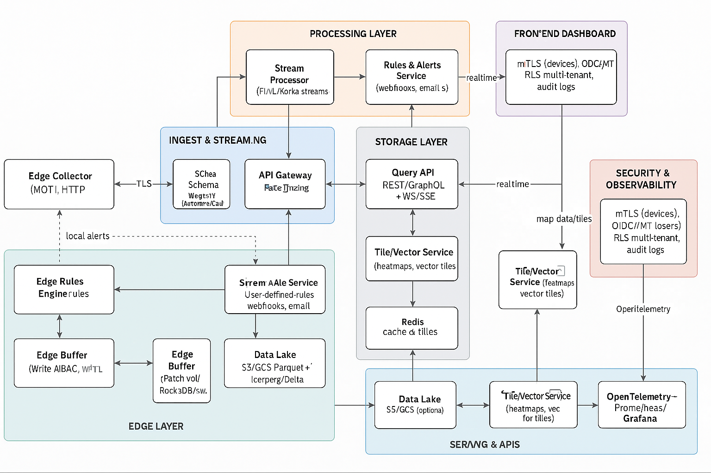

# Arquitetura

O presente documento descreve a arquitetura de software para uma plataforma de rastreamento e visualização de dados, com suporte a **edge computing** para operação em regiões com baixa disponibilidade de rede.

A solução é composta por:

-   **Camada de borda** para coleta e pré-processamento de dados em dispositivos/gateways locais.
-   **Pipeline de ingestão e processamento em nuvem** para manipulação de fluxos em tempo real.
-   **Camada de armazenamento** otimizada para dados geoespaciais e séries temporais.
-   **Serviços de API** para consumo interno e externo.
-   **Frontend interativo** para visualização em dashboards, mapas e gráficos.
-   **Mecanismos de observabilidade e segurança** cobrindo todo o fluxo.

Essa arquitetura visa garantir **baixa latência**, **resiliência a falhas de conexão**, **escalabilidade horizontal** e **facilidade de manutenção**.

---

## Visão Geral

A arquitetura é dividida em **cinco camadas principais**:

1. **Edge Layer** – coleta, validação, persistência local e execução de regras simples.
2. **Ingest & Streaming Layer** – ingestão de dados em alta escala, autenticação e roteamento para processamento.
3. **Processing Layer** – enriquecimento, cálculo de métricas e detecção de eventos.
4. **Storage Layer** – armazenamento quente (hot) e frio (cold) para dados recentes e históricos.
5. **Serving & Visualization Layer** – APIs, serviços de consulta e dashboard interativo.

---

## Diagrama

## Componentes da Arquitetura

| **Componente**                   | **Descrição**                                                                                                                                        |
| -------------------------------- | ---------------------------------------------------------------------------------------------------------------------------------------------------- |
| **Edge Collector**               | Serviço no dispositivo/gateway que recebe dados de GPS/IoT (via MQTT, HTTP, gRPC), valida e salva localmente (RocksDB/SQLite) para operação offline. |
| **Edge Buffer & Sync Client**    | Fila persistente que garante envio confiável dos dados para a nuvem, com compressão e reenvio automático quando a conexão é restabelecida.           |
| **Edge Rules Engine**            | Motor de regras locais (geofencing, velocidade, alarmes) para acionar eventos sem depender de conexão.                                               |
| **API Gateway**                  | Ponto central de entrada, gerencia autenticação (mTLS para dispositivos, JWT para usuários), autorização e rate limiting.                            |
| **Message Broker**               | Kafka/Redpanda para ingestão em alta escala, com tópicos particionados por cliente/região/tipo de evento.                                            |
| **Schema Registry**              | Controle de esquemas (Avro/Protobuf) garantindo compatibilidade e evolução de dados.                                                                 |
| **Stream Processor**             | Flink/Kafka Streams para enriquecimento, ordenação de eventos fora de ordem e geração de agregados/alertas.                                          |
| **Rules & Alerts Service**       | Gestão de regras definidas pelo usuário e emissão de notificações (push, e-mail, webhook).                                                           |
| **Hot Storage (TimescaleDB)**    | Banco otimizado para séries temporais e consultas geoespaciais (PostGIS), com retenção configurável para dados recentes.                             |
| **Cold Storage (Data Lake)**     | Armazenamento de longo prazo (S3/GCS) em formato parquet com catálogo Iceberg/Delta.                                                                 |
| **Redis Cache**                  | Armazena dados recentes e tiles pré-processados para visualizações rápidas.                                                                          |
| **Query API (REST/GraphQL)**     | Serviço de consultas aos dados, com suporte a WebSockets/SSE para atualizações em tempo real.                                                        |
| **Tile/Vector Service**          | Geração e fornecimento de tiles de mapa e vetores geoespaciais para renderização no frontend.                                                        |
| **Frontend Dashboard**           | SPA (React/Next.js) com mapas (MapLibre/Mapbox), gráficos (Recharts/ECharts) e filtros dinâmicos.                                                    |
| **Observabilidade**              | Stack com OpenTelemetry, Prometheus, Grafana, Loki e Tempo para métricas, logs e rastreamento distribuído.                                           |
| **Segurança & Gestão de Acesso** | RBAC/ABAC por usuário e cliente, criptografia de dados em trânsito (TLS 1.2+), rotação de credenciais e auditoria de acesso.                         |

---

## Fluxo de Dados

1. **Coleta na Borda**
   Dispositivo/gateway recebe dados via sensores ou GPS, valida e salva localmente.

2. **Processamento Local e Armazenamento Temporário**
   Regras locais executadas no Edge Rules Engine; dados persistidos no Edge Buffer.

3. **Sincronização com a Nuvem**
   Quando online, Sync Client envia lotes de dados compactados para o API Gateway.

4. **Ingestão e Publicação no Broker**
   API Gateway valida e encaminha dados para tópicos Kafka, seguindo schema registrado.

5. **Processamento em Fluxo**
   Stream Processor enriquece dados, ordena eventos, calcula métricas e detecta eventos.

6. **Armazenamento**
   Dados recentes → Hot Storage (TimescaleDB/PostGIS).
   Dados antigos → Cold Storage (Data Lake).

7. **Consulta e Visualização**
   Query API e Tile Service fornecem dados para o frontend, que exibe mapas, gráficos e alertas em tempo real.

---

## Considerações de Escalabilidade

-   **Horizontal Scaling**: Todos os serviços core (ingestão, processamento, APIs) são stateless, permitindo replicação horizontal.
-   **Particionamento de Tópicos Kafka**: Por cliente, dispositivo e região, garantindo processamento paralelo.
-   **Caches de Leitura**: Redis para minimizar consultas a banco em endpoints de alto tráfego.
-   **Retenção Balanceada**: Dados quentes (≤30 dias) para consultas rápidas, dados frios em storage barato.

---

## Estratégias de Resiliência e Operação Offline

-   **Persistência Local**: Armazenamento WAL no edge para evitar perda de dados em quedas de rede.
-   **Execução de Regras na Borda**: Notificações e alarmes críticos funcionam mesmo offline.
-   **Reenvio Inteligente**: Lotes com compressão e deduplicação; backoff exponencial.
-   **Atualizações OTA**: Edge recebe atualizações de firmware/configuração via conexão segura.

---

## Segurança

-   **mTLS** para autenticação de dispositivos.
-   **JWT/OIDC** para autenticação de usuários.
-   **Criptografia em trânsito** (TLS 1.2+).
-   **Row-Level Security** no banco para isolamento multi-tenant.
-   **Logs de auditoria** para acesso e alterações críticas.

---

## Observabilidade

-   **OpenTelemetry** para rastreamento distribuído.
-   **Prometheus** para métricas de sistema e negócio.
-   **Grafana** para dashboards operacionais.
-   **Loki + Tempo** para centralização de logs e traces.

---

## Conclusão

Essa arquitetura combina **processamento local** para resiliência em ambientes com baixa conectividade com **processamento e visualização em nuvem** para escala e análise avançada.
O uso de padrões como **CQRS**, **event streaming** e **multi-tenant isolation** garante que a plataforma seja flexível, segura e capaz de crescer junto com a base de usuários e dispositivos.
